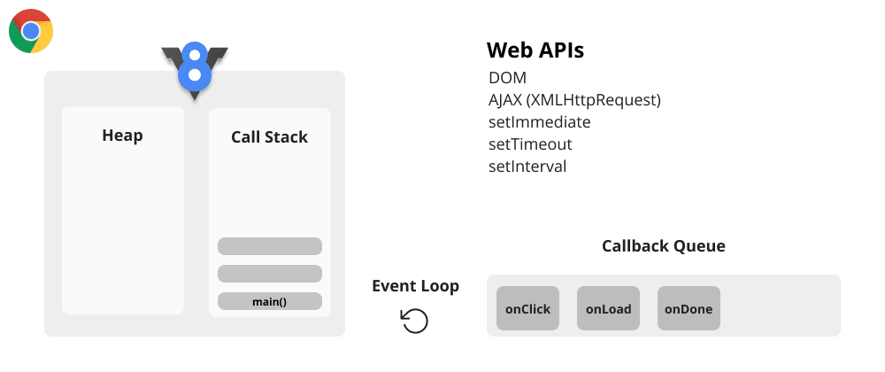
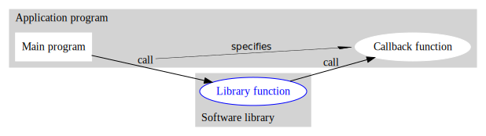

# Functional Programming

<aside>
🔥 Functional programming is a programming paradigm that emphasizes using functions as the foundation of software. Functions are treated as first-class citizens, meaning they can be assigned to variables, passed as arguments, and returned as values.

</aside>

This allows programmers to write independent functions that can solve complex problems and combine them together. Functions should have no side effects and emphasize immutability, making code more predictable and easier to reason about. Recursion is also essential, allowing functions to call themselves in a more elegant way than iterative loops. Popular functional programming languages include Haskell, Lisp, and Clojure, and many modern programming languages also have functional programming features. However, functional programming has a steep learning curve and may not be suitable for all tasks.

## Differences between imperative and declarative

| Imperative               | Declarative               |
| ------------------------ | ------------------------- |
| focus on the flow        | focus on logic            |
| mutable states           | immutability              |
| as                       | what                      |
| greater amount of code   | less amount of code       |
| low level of scalability | high level of scalability |
| better known             | less known                |
| more explicit            | less explicit             |

## Examples

### Imperative Paradigm

The imperative paradigm is a programming paradigm that focuses on describing how a program should achieve its goals by giving explicit instructions, or commands, that modify the program state. In the imperative paradigm, a program is seen as a sequence of instructions that manipulate variables and control structures in order to achieve a specific result.

In an imperative program, the programmer specifies a sequence of operations that must be executed in order to achieve a desired result. These operations are typically expressed using control structures such as loops, conditionals, and subroutines, and they can modify the program state by changing the values of variables, reading or writing to input/output devices, or calling other functions.

Here's an example of an imperative program that prints the first 10 even numbers:

```jsx
for (let i = 0; i < 20; i++) {
  if (i % 2 === 0) {
    console.log(i);
  }
}
```

In this example, the program uses a **`for`** loop to iterate over the numbers from 0 to 19. For each number, it checks whether it is even using an **`if`** statement, and if so, it prints it to the console using the **`console.log`** function.

The imperative paradigm is widely used in programming, especially in systems programming, where performance and control over low-level hardware are important. However, it can lead to code that is difficult to read and maintain, especially as programs become more complex.

One of the main challenges of the imperative paradigm is managing the program state and ensuring that it remains consistent as the program executes. Imperative programs can also be prone to bugs, as the programmer must ensure that the sequence of instructions is correct and does not produce unexpected behavior.

### Declarative Paradigm

The declarative paradigm is a programming paradigm that focuses on describing what a program should achieve, rather than how to achieve it. In the declarative paradigm, a program is expressed in terms of a set of rules or constraints that define the desired output or behavior.

In a declarative program, the programmer specifies a set of rules or constraints that define the problem domain, and a set of operations or transformations that should be applied to the data in order to produce the desired output. The program does not specify the sequence of operations, but rather the relationships between data elements and the desired outcomes.

One of the key benefits of the declarative paradigm is that it allows the programmer to focus on the problem domain and the desired outcomes, rather than the details of how to achieve those outcomes. This can make programs easier to read, maintain, and reason about, especially as programs become more complex.

Here's an example of a declarative program that calculates the sum of an array of numbers:

```jsx
const numbers = [1, 2, 3, 4, 5];

const sum = numbers.reduce((accumulator, currentValue) => accumulator + currentValue, 0);

console.log(sum); // 15
```

In this example, the program expresses the desired outcome in terms of a single operation, the **`reduce()`** function, which takes an array of numbers and returns their sum. The program does not specify the sequence of operations that should be used to achieve this outcome, but rather relies on the built-in **`reduce()`** function to do the work.

The declarative paradigm is widely used in functional programming, where programs are expressed in terms of data transformations and operations on immutable data structures. It is also used in logic programming, where programs are expressed in terms of logical rules and constraints that define the relationships between data elements.

One of the main challenges of the declarative paradigm is that it can be less intuitive for programmers who are used to thinking in terms of imperative programs. Declarative programs can also be less efficient than imperative programs, as they may require more computation to achieve the same result. However, the benefits of declarative programming, such as increased readability and maintainability, often outweigh these drawbacks in many contexts.

---

## First Class Functions

In programming languages that support first-class functions, functions are treated as first-class citizens, meaning they can be treated just like any other value in the language, such as a number or a string. This means that functions can be assigned to variables, passed as arguments to other functions, and returned as values from functions.

Here's an example of assigning a function to a variable in JavaScript:

```jsx
const add = function(a, b) {
  return a + b;
}
```

In this example, the **`add`** function is defined using a function expression and then assigned to the **`add`** variable. The **`add`** variable can now be used just like any other variable in the program.

First-class functions enable a wide range of programming techniques, such as higher-order functions, which are functions that take other functions as arguments or return functions as values. Higher-order functions are used extensively in functional programming, and can simplify many programming tasks by allowing for generic and reusable code.

Here's an example of using a higher-order function to implement a map function in JavaScript:

```jsx
const map = function(array, transform) {
  const result = [];
  for (const element of array) {
    result.push(transform(element));
  }
  return result;
}

const numbers = [1, 2, 3, 4, 5];

const doubled = map(numbers, function(n) {
  return n * 2;
});

console.log(doubled); // [2, 4, 6, 8, 10]

```

In this example, the **`map`** function takes an array and a transformation function as arguments, and returns a new array with the transformed values. The transformation function is a higher-order function, which takes an element of the array as input and returns a transformed value. The **`map`** function then applies this transformation to each element of the array, using a loop, and returns the result.

## Composition of Functions

Function composition is a technique that allows you to create a new function by combining two or more existing functions. This can be achieved using a variety of approaches, including chaining function calls, using the **`apply`** or **`call`** methods, and using higher-order functions.

Here's an example of function composition using chaining function calls:

```jsx
function add(a, b) {
  return a + b;
}

function multiply(a, b) {
  return a * b;
}

function addThenMultiply(a, b, c) {
  return multiply(add(a, b), c);
}

const result = addThenMultiply(2, 3, 4);
console.log(result); // 20
```

In this example, we have three functions - **`add`**, **`multiply`**, and **`addThenMultiply`**. The **`addThenMultiply`** function combines the **`add`** and **`multiply`** functions by chaining their calls together. The result of the **`add`** function, which is the sum of **`a`** and **`b`**, is passed as the first argument to the **`multiply`** function, along with **`c`**. The final result is the product of the sum of **`a`** and **`b`** and **`c`**.

Another approach to function composition in JavaScript is to use higher-order functions. Here's an example:

```jsx
function add(a, b) {
  return a + b;
}

function multiply(a, b) {
  return a * b;
}

function compose(fn1, fn2) {
  return function(a, b, c) {
    return fn2(fn1(a, b), c);
  };
}

const addAndMultiply = compose(add, multiply);
const result = addAndMultiply(2, 3, 4);
console.log(result); // 20
```

In this example, we define a new function called **`compose`**, which takes two functions as arguments and returns a new function that combines them. The **`addAndMultiply`** function is created by passing **`add`** and **`multiply`** to **`compose`**. When **`addAndMultiply`** is called with the arguments **`(2, 3, 4)`**, the output of **`add`** is passed as the first argument to **`multiply`**, resulting in the value **`20`**.

---

## Why was functional programming adopted late?

The main culprit: **Memory**

- Functional programming was created in 1957, before Structured Programming and Object-Oriented Programming.
- However, functional programming was not viable at the time, due to the high cost of memory.

## Value vs Reference

```java
int a = 2;
int b = a;

```

In this case, the program is using more memory than necessary because a copy of the value was made, even though there was space available.

The decision to make a copy of the value was taken because an integer value is a basic and primitive type that consumes little memory. Therefore, it is more logical to generate a copy of the value than to make the same variable point to the same memory address.

```java
Object a = new Object();

```

When dealing with objects, things change a bit. When we create an object, it usually occupies a large space in memory.

In a variable, the content of the object is not stored, but rather a reference to the location where the object is in memory. For example, if we create an object B that receives the value of object A, the reference to the location in memory is copied.

This means that we will have two variables pointing to the same location in memory.

---

## PLoP

- Place-Oriented Programming;
- New information replaces the old;
- Arose from a limitation in early computing
- Limited RAM and disk space

1940 → I invented a bit of memory

1953 → I invented a byte of memory

1966 → 1K

1978 → 32k

2011 → Look, 100 terabytes

2038 → What memory?

## Temporal Coupling

Temporal coupling is a programming concept that refers to the degree to which two parts of a program depend on each other's runtime. In other words, temporal coupling describes how one part of the program is linked to another part of the program in terms of runtime.

A common example of temporal coupling is when a piece of code waits for another piece of code to finish executing before continuing. This can lead to performance and reliability issues, especially if the runtime of one part of the program cannot be accurately predicted.

To minimize temporal coupling, it is recommended to divide the program into independent and well-defined modules that can run autonomously without depending on the runtime of other modules. This can help improve the efficiency, scalability, and maintainability of the program.

## Why switch?

- Functional programming is simpler;
- It makes it easier to write and maintain code;
- It has no temporal coupling;
- Few concurrency issues;
- It works with immutability.

## How Javascript Works

<aside>
🔥 A session on how JavaScript works can focus on three important aspects of its runtime environment: the heap, call stack, and event queue.

</aside>

### HEAP

<aside>
🔥 The heap is the memory space where objects are stored in JavaScript. When you declare a new variable or object in your code, it is allocated memory on the heap.

</aside>



In Javascript, the heap is the part of the computer memory where objects are stored. It is managed by the garbage collector of Javascript and is responsible for allocating and deallocating memory for dynamically created and removed objects during program execution.

The Javascript heap is where values of objects, arrays, functions, and other complex data types are stored. When an object is created, it is allocated in the heap and can be accessed through a reference. When the object is no longer needed, the garbage collector releases the memory occupied by it, marking it as "collectible."

Efficient management of the heap is important to ensure that a Javascript program runs efficiently and without errors. It is important to avoid memory leaks that occur when objects are allocated in the heap but are never removed, occupying unnecessary space and making the program slow and unstable. Excessive use of the heap can also lead to performance problems, as the garbage collector needs to spend more time managing the allocated memory.

### STACK

<aside>
🔥 The call stack is a data structure that keeps track of the current position in your code. Whenever a function is called, its context is pushed onto the stack. When a function returns, its context is popped off the stack, and execution resumes at the previous position.

</aside>


In Javascript, the stack is a data structure used to store information about code execution. It is a stack that contains a series of frames, each of which represents an execution context.

The stack is used to track the order of function execution. Whenever a function is called, a new frame is added to the stack. This frame contains information about the function, including its name, parameters, and local variables. When the function returns, the frame is removed from the stack, and execution continues from the point where the function was called.

The stack is important to ensure that the code is executed in the correct order. It is used to control the execution of functions and ensure that the local variables of one function do not interfere with the variables of another function that is being executed simultaneously. In addition, the stack is used to detect execution errors, such as stack overflows, which occur when the amount of information stored in the stack exceeds the maximum limit allowed by the execution environment.

In summary, the stack is a crucial data structure in the execution of Javascript code, and its proper use is important to ensure that the code is executed efficiently and without errors.

### EVENT QUEUE

<aside>
🔥 The event queue is a list of events that have been triggered but are waiting to be processed. JavaScript is single-threaded, meaning that it can only execute one task at a time. When an event occurs, such as a click or a network request, it is added to the event queue. The event loop continuously checks the event queue for new events and processes them one by one.

</aside>


The Event Queue is an important part of Javascript's asynchronous programming model. It is a queue (or list) of events (or tasks) waiting to be executed. Each event in the queue is associated with a callback function that will be executed when the event is processed.

Events in the queue are added whenever an asynchronous action occurs in the program, such as an AJAX request, an animation, a timer event, or user input. When an event is added to the queue, it waits until the execution stack is empty to be processed.

The processing of events in the queue is done by Javascript's event loop. The event loop is responsible for continuously checking if there are events in the queue, and if so, executing them in order. It takes the first event in the queue and executes its callback function until the function returns. Then it takes the next event in the queue and repeats the process.

The use of the event queue allows Javascript to execute asynchronous tasks without blocking synchronous code execution. This is important to ensure that the user interface does not freeze while the code performs time-consuming tasks or waits for external events. In addition, the use of callbacks allows asynchronous code to be executed in a non-linear fashion, which is essential for developing complex and responsive applications.

In summary, the event queue is a fundamental part of Javascript's asynchronous programming model, and its proper use is important to ensure that the code is executed efficiently and responsively.

<aside>
🔥 Understanding these three components is essential to understanding how JavaScript works at a fundamental level. It helps developers write more efficient and effective code, by knowing how memory is allocated, how the call stack operates, and how event-driven programming works in JavaScript.

</aside>

---

# Understanding Functions in JavaScript

## Function Expression

A function expression is a way to define a function as a value assigned to a variable. This allows the function to be passed around and used in a flexible manner, much like any other data type.

Here's an example of a function expression in JavaScript:

```jsx
function add(a, b) {
  return a + b;
};

const result = add(2, 3); // result is 5
```

In this example, we define a function **`add`** using the function expression syntax.

## Anonymous Function

An anonymous function is a function that has no name and is not bound to any identifier. Instead, it is usually defined as a function expression, which is a way to define a function as a value assigned to a variable.

Here's an example of an anonymous function defined using a function expression:

```jsx
const sum = function(a, b) {
  return a + b;
};

const result = sum(2, 3); // result is 5
```

In this example, we define a function expression that adds two numbers together and assigns it to the variable **`sum`**. Because the function has no name, it is referred to as an anonymous function.

## Immediately Invoked Function Expression (IIFE)

An Immediately Invoked Function Expression (IIFE) in JavaScript is a function that is executed immediately after it is defined, without the need for a separate function call. It is a common pattern used in JavaScript to create a private scope for code, prevent naming conflicts, and control the timing of code execution.

Here's an example of an IIFE:

```jsx
 (function() {
  console.log('This code is executed immediately.');
})();
```

In this example, we define an anonymous function inside a pair of parentheses, and immediately invoke it by adding another pair of parentheses after the function definition. The function body contains a call to **`console.log`**, which prints a message to the console.

## Arrow Function

Arrow function is an anonymous JavaScript function introduced in ES6 (ECMAScript 2015) that uses the "arrow" syntax (=>) to define a function more succinctly and with a different variable scope than traditional functions.

The basic syntax of an arrow function is as follows:

```jsx
const arrow = () => console.log('Arrow Function')
arrow()

const greeting = name => `Hello ${name}`

const sum = (...numbers) => {
	let total = 0
	for(let n of numbers) {
		total += n
	}
	return total
}

console.log(sum(10,30,40,50))

const pow = base => exp => Math.pow(base,exp)

console.log(pow(2)(4))

// this
Array.prototype.log = function() {
	console.log(this)
}

Array.prototype.last = () => {
	console.log(this[0])
} // not work

const numbers = [1, 2, 3]

numbers.log()

numbers.last() // undefined
```

An arrow function can have zero or more parameters enclosed in parentheses, and the function body is enclosed in curly braces ({}) if there is more than one statement, or it can be a single expression if there is only one statement. Additionally, the **`return`** keyword does not need to be explicitly used to return a value, since the returned value is implicitly the result of the last evaluated expression.

Another important difference is that arrow functions do not have their own **`this`** object, which means that the value of **`this`** is inherited from the context where the function was defined, instead of being defined in the function call. This can be useful in cases where the value of **`this`** needs to be preserved, such as in callback functions.

Finally, arrow functions are generally more concise and easier to read than traditional functions, especially when it comes to simple functions or single returns.

## Constructor Functions

Constructor functions in JavaScript are a way to create objects that share the same properties and methods. They are typically defined with a capitalized name to differentiate them from regular functions.

Here's an example of a constructor function that creates a **`Person`** object with a **`name`** property and a **`greet`** method:

```jsx
function Person(name) {
  this.name = name;
}

Person.prototype.greet = function() {
  console.log('Hello, my name is ' + this.name);
}
```

In this example, we define a **`Person`** constructor function that takes a **`name`** parameter and sets it as the **`name`** property on the newly created object using the **`this`** keyword. We also define a **`greet`** method on the **`Person`** prototype, which logs a greeting message to the console with the object's **`name`** property.

To create a new **`Person`** object, we can use the **`new`** keyword to call the **`Person`** constructor:

```jsx
const john = new Person('John');
john.greet(); // Output: Hello, my name is John
```

In this example, we create a new **`Person`** object called **`john`** with the name 'John'. We then call the **`greet`** method on the **`john`** object, which logs a greeting message to the console with the object's **`name`** property.

## Getter Functions

Getter functions in JavaScript are used to retrieve the value of an object's property. They allow you to define a method that is called when a property is accessed, rather than simply returning the value of the property directly.

To define a getter function, you use the **`get`** keyword followed by the name of the property, and then define a function that returns the value of the property. Here's an example:

```jsx
const person = {
  firstName: 'John',
  lastName: 'Doe',
  get fullName() {
    return this.firstName + ' ' + this.lastName;
  }
};

console.log(person.fullName); // Output: "John Doe"
```

In this example, we define an object called **`person`** with two properties: **`firstName`** and **`lastName`**. We then define a getter function called **`fullName`** using the **`get`** keyword. When we access the **`fullName`** property, the getter function is called and returns the concatenation of **`firstName`** and **`lastName`**.

Getter functions can be useful when you want to calculate a property value on the fly, or when you want to perform some kind of validation or transformation on a property value before returning it. They also allow you to create properties that appear to be read-only, since there is no direct way to set the value of a getter property.

Here's an example of using a getter function to calculate the area of a circle based on its radius:

```jsx
const circle = {
  radius: 5,
  get area() {
    return Math.PI * this.radius * this.radius;
  }
};

console.log(circle.area); // Output: 78.53981633974483
```

In this example, we define an object called **`circle`** with a **`radius`** property and a **`get`** function called **`area`**. When we access the **`area`** property, the getter function is called and calculates the area of the circle using the formula **`πr^2`**.

## Hoisting

Hoisting in JavaScript is a behavior where variable and function declarations are moved to the top of their respective scopes during the compilation phase, before the code is executed. This means that variables and functions can be used before they are declared.

However, it's important to note that only the declarations are hoisted, not the assignments. This means that while you can use a variable or function before it is declared, any assignments or function expressions will not be hoisted and will result in a reference error.

Here's an example of hoisting in action:

```jsx
console.log(myName); // Output: undefined
var myName = "John";
```

In this example, we declare a variable called **`myName`** and then immediately log it to the console. However, since the declaration is hoisted to the top of the scope, the value of **`myName`** is **`undefined`** at the time of the **`console.log`** statement.

Here's another example with a function declaration:

```jsx
greet("John"); // Output: "Hello John"

function greet(name) {
  console.log("Hello " + name);
}
```

In this example, we define a function called **`greet`** and then immediately call it with a name argument. Since the function declaration is hoisted to the top of the scope, the call to **`greet`** is valid and will output "Hello John" to the console.

---

## Callback



In programming, a callback is a function that is passed as an argument to another function and will be executed when a certain event occurs or when the original function finishes its execution.

A common example of using callbacks is in asynchronous functions, such as in HTTP requests. When a request is made, it is sent to the server and the function does not wait for the response, continuing to execute the rest of the code. When the response is received, the callback function is called, allowing the code to handle the response data.

Another example is in user interface, where a callback function can be used to respond to user input events, such as clicking a button or typing text in an input box.

The use of callbacks is an important technique in asynchronous programming and helps make the code more modular and flexible.

- Examples:

```jsx
function exec(fn, a, b) {
	return fn(a,b)
}

const sum = (x,y) => console.log(x + y)

const subtract = (w,z) => console.log(w -z)

exec(sum, 30, 40)

const fn = () => console.log('interval')
setInterval(fn, 1000)
```

```jsx
const fs = require('fs')
const path = require('path')

const myPath = path.join(__dirname, 'data.txt')

function showContent(err, data) {
	console.log(data)
}

console.log('Start..')
fs.readFile(myPath, {}, showContent)
console.log('End..')

console.log('Start Sync')
const content = fs.readFileSync(myPath)
console.log(content)
console.log('End Sync')

```

## Map

The **`map()`** function in JavaScript is a method that is available on arrays. It creates a new array by applying a callback function to each element of the original array.

The syntax of the **`map()`** function is as follows:

```jsx
array.map(callback(currentValue[, index[, array]])[, thisArg])
```

The **`callback`** function is called for each element in the array, and it can take up to three arguments:

- **`currentValue`**: The value of the current element being processed in the array.
- **`index`** (optional): The index of the current element being processed in the array.
- **`array`** (optional): The original array on which **`map()`** was called.

The **`callback`** function should return a new value for each element in the array. The **`map()`** function will then create a new array with the same length as the original array, where each element is the result of calling the **`callback`** function on the corresponding element in the original array.

Here's an example of using **`map()`** to create a new array of numbers that are twice the values of the original array:

```jsx

const numbers = [1, 2, 3, 4, 5];

const doubledNumbers = numbers.map((num) => {
  return num * 2;
});

console.log(doubledNumbers); // [2, 4, 6, 8, 10]
```

In this example, the **`map()`** function is called on the **`numbers`** array, and a callback function is passed to it that takes each element in the array and returns a new value that is twice the original value. The **`map()`** function then creates a new array (**`doubledNumbers`**) where each element is the result of calling the callback function on the corresponding element in the original array.

The **`map()`**function is a useful tool for transforming data in an array into a new array of transformed data. It can be used in a variety of scenarios, including filtering out certain elements, transforming strings into numbers, and much more.

Below is the implementation of `map`:

```jsx
Array.prototype.newMap = function(fn) {
	const mapped = []
	for(let i = 0; i < this.length; i++) {
		const result = fn(this[i])
		mapped.push(result)
	}
	return mapped
}
```

## Filter

The **`filter()`** function in JavaScript is a method that is available on arrays. It creates a new array with all elements that pass the test implemented by the provided callback function.

The syntax of the **`filter()`** function is as follows:

```jsx
array.filter(callback(currentValue[, index[, array]])[, thisArg]
```

The **`callback`** function is called for each element in the array, and it can take up to three arguments:

- **`currentValue`**: The value of the current element being processed in the array.
- **`index`** (optional): The index of the current element being processed in the array.
- **`array`** (optional): The original array on which **`filter()`** was called.

The **`callback`** function should return **`true`** if the current element passes the test, and **`false`** otherwise. The **`filter()`** function will then create a new array with all elements for which the **`callback`** function returned **`true`**.

Here's an example of using **`filter()`** to create a new array of even numbers from an original array of numbers:

```jsx
const numbers = [1, 2, 3, 4, 5];

const evenNumbers = numbers.filter((num) => {
  return num % 2 === 0;
});

console.log(evenNumbers); // [2, 4]
```

In this example, the **`filter()`** function is called on the **`numbers`** array, and a callback function is passed to it that takes each element in the array and returns **`true`** if the element is even, and **`false`** otherwise. The **`filter()`** function then creates a new array (**`evenNumbers`**) with all elements from the original array that returned **`true`** when passed to the callback function.

The **`filter()`** function is a useful tool for filtering data in an array based on a condition. It can be used in a variety of scenarios, including selecting certain elements, removing unwanted elements, and much more.

Below is the implementation of `filter`:

```jsx
Array.prototype.newFilter = function(fn) {
	const newArray = []
	for(let i = 0; i < this.length; i++) {
		if(fn(this[i], i, this)) {
		newArray.push(this[i])
		}
	}
	return newArray;
}
```

## Reduce

The **`reduce()`** function in JavaScript is a method that is available on arrays. It is used to reduce an array to a single value by applying a callback function to each element of the array.

The syntax of the **`reduce()`** function is as follows:

```jsx
array.reduce(callback(accumulator, currentValue[, index[, array]])[, initialValue])
```

The **`callback`** function is called for each element in the array, and it can take up to four arguments:

- **`accumulator`**: The accumulated value computed by the previous invocation of the **`callback`** function or the **`initialValue`**.
- **`currentValue`**: The value of the current element being processed in the array.
- **`index`** (optional): The index of the current element being processed in the array.
- **`array`** (optional): The original array on which **`reduce()`** was called.

The **`callback`** function should return the accumulated value after processing the current element. The **`reduce()`** function will then iterate through the array, calling the **`callback`** function for each element, and accumulating the result. The final value returned by **`reduce()`** will be the accumulated value after processing the last element in the array.

If an **`initialValue`** is provided, it will be used as the initial accumulated value, and the **`callback`** function will start processing the first element in the array. If no **`initialValue`** is provided, the first element in the array will be used as the initial accumulated value, and the **`callback`** function will start processing the second element in the array.

Here's an example of using **`reduce()`** to calculate the sum of an array of numbers:

```jsx
const numbers = [1, 2, 3, 4, 5];

const sum = numbers.reduce((accumulator, currentValue) => {
  return accumulator + currentValue;
}, 0);

console.log(sum); // 15
```

In this example, the **`reduce()`** function is called on the **`numbers`** array, and a callback function is passed to it that takes the accumulated value and the current element, and returns the sum of the two. The **`reduce()`** function then iterates through the array, accumulating the sum of all elements, and returns the final sum.

The **`reduce()`** function is a powerful tool for performing complex operations on arrays, including calculating averages, finding maximum or minimum values, and much more. It requires a good understanding of the callback function and how it accumulates values, but can be very useful in many scenarios.

The declarative paradigm is a programming paradigm that focuses on describing what a program should achieve, rather than how to achieve it. In the declarative paradigm, a program is expressed in terms of a set of rules or constraints that define the desired output or behavior.

In a declarative program, the programmer specifies a set of rules or constraints that define the problem domain, and a set of operations or transformations that should be applied to the data in order to produce the desired output. The program does not specify the sequence of operations, but rather the relationships between data elements and the desired outcomes.

One of the key benefits of the declarative paradigm is that it allows the programmer to focus on the problem domain and the desired outcomes, rather than the details of how to achieve those outcomes. This can make programs easier to read, maintain, and reason about, especially as programs become more complex.

Here's an example of a declarative program that calculates the sum of an array of numbers:

```jsx
const numbers = [1, 2, 3, 4, 5];

const sum = numbers.reduce((accumulator, currentValue) => accumulator + currentValue, 0);

console.log(sum); // 15
```

In this example, the program expresses the desired outcome in terms of a single operation, the **`reduce()`** function, which takes an array of numbers and returns their sum. The program does not specify the sequence of operations that should be used to achieve this outcome, but rather relies on the built-in **`reduce()`** function to do the work.

The declarative paradigm is widely used in functional programming, where programs are expressed in terms of data transformations and operations on immutable data structures. It is also used in logic programming, where programs are expressed in terms of logical rules and constraints that define the relationships between data elements.

One of the main challenges of the declarative paradigm is that it can be less intuitive for programmers who are used to thinking in terms of imperative programs. Declarative programs can also be less efficient than imperative programs, as they may require more computation to achieve the same result. However, the benefits of declarative programming, such as increased readability and maintainability, often outweigh these drawbacks in many contexts.

Below is the implementation of `reduce`:

```jsx
Array.prototype.myReduce = function(callback, initialValue) {
  let accumulator = initialValue === undefined ? undefined : initialValue;

  for (let i = 0; i < this.length; i++) {
    if (accumulator !== undefined) {
      accumulator = callback(accumulator, this[i], i, this);
    } else {
      accumulator = this[i];
    }
  }

  return accumulator;
}
```
## Promise

Promise is an object that represents the eventual completion or failure of an asynchronous operation, and its resulting value.

Promises are a way to handle asynchronous operations without using callbacks, which can lead to callback hell and make code difficult to read and maintain. Instead of relying on callbacks to handle the result of an asynchronous operation, you can use Promises to handle success and failure cases in a more structured way.

Here's an example of how you can create a Promise in JavaScript:

```jsx
const myPromise = new Promise((resolve, reject) => {
  // Perform some asynchronous operation
  setTimeout(() => {
    const randomNumber = Math.random();
    if (randomNumber < 0.5) {
      resolve(randomNumber); // Promise is fulfilled
    } else {
      reject(new Error('Number too high')); // Promise is rejected
    }
  }, 1000);
});
```

In this example, we create a new Promise object that takes a function with two arguments: **`resolve`** and **`reject`**. Within this function, we perform an asynchronous operation that resolves or rejects the Promise based on a random number. If the number is less than 0.5, the Promise is resolved with the number as its value. If the number is greater than or equal to 0.5, the Promise is rejected with an Error object.

Once we have created the Promise, we can use its methods **`then`** and **`catch`** to handle the success and failure cases respectively. Here's an example:

```jsx
myPromise.then((result) => {
  console.log(`The number is ${result}`);
}).catch((error) => {
  console.error(error);
});
```

In this example, we use the **`then`** method to handle the resolved Promise, and log the result to the console. We use the **`catch`** method to handle the rejected Promise, and log the error to the console.

Promises can be chained together using the **`then`** method, which returns a new Promise. This allows you to create a series of asynchronous operations that depend on each other. Here's an example:

```jsx
const myPromise = new Promise((resolve, reject) => {
  setTimeout(() => {
    resolve(5);
  }, 1000);
});

myPromise.then((result) => {
  return result * 2; // Returns a new Promise with a value of 10
}).then((result) => {
  console.log(result); // Output: 10
}).catch((error) => {
  console.error(error);
});
```

In this example, we create a Promise that resolves with a value of 5 after 1 second. We then chain two **`then`** methods together to perform some calculations on the result of the Promise. The first **`then`** method multiplies the result by 2, which returns a new Promise with a value of 10. The second **`then`** method logs the final result to the console. If any errors occur, they will be caught by the **`catch`** method.
## Async/Await

**`Async/await`** is a way to handle asynchronous operations that is built on top of **`Promises`**. The main difference between **`async/await`** and **`then/catch`** is the syntax and readability.

With **`async/await`**, you write asynchronous code that looks more like synchronous code. You use the **`async`** keyword before a function declaration to indicate that it will return a promise, and the **`await`** keyword within the function body to wait for a promise to resolve before continuing execution. Here is an example:

```jsx
async function fetchData() {
  const response = await fetch('https://api.example.com/data');
  const data = await response.json();
  return data;
}
```

In this example, the **`fetchData`** function is declared as **`async`**, which means that it will return a **`Promise`**. Within the function, we use the **`await`** keyword to wait for the **`fetch`** method to return a response, and then we use it again to wait for the **`json`** method to parse the response into data.

With **`then/catch`**, you chain together methods that return promises using the **`then`** method. Here is an example:

```jsx
function fetchData() {
  return fetch('https://api.example.com/data')
    .then(response => response.json())
    .catch(error => console.log(error));
}
```

In this example, the **`fetchData`** function returns a promise that resolves with the parsed JSON data or rejects with an error. We chain together the **`then`** and **`catch`** methods to handle the resolution and rejection of the promise.

One advantage of **`async/await`** over **`then/catch`** is that it allows for more readable and concise code, especially when dealing with complex asynchronous logic. However, it's important to note that **`async/await`** is simply a syntax for working with **`Promises`** and is not a replacement for them.
## OOP

JavaScript supports Object-Oriented Programming (OOP) through the use of objects and prototypes.

In JavaScript, an object is a collection of key-value pairs, where the key is a string (or symbol) and the value can be any data type, including other objects. You can create an object using object literal syntax, like this:

```jsx
const person = {
  name: 'John',
  age: 30,
  sayHello() {
    console.log(`Hello, my name is ${this.name}.`);
  }
};
```

In this example, we define an object called **`person`** with properties for **`name`** and **`age`**, as well as a method called **`sayHello`** that uses the **`this`** keyword to refer to the current object.

In JavaScript, you can also create object templates using constructor functions, which allow you to create multiple instances of an object with shared properties and methods. Here is an example:

```jsx
function Person(name, age) {
  this.name = name;
  this.age = age;
}

Person.prototype.sayHello = function() {
  console.log(`Hello, my name is ${this.name}.`);
}

const person1 = new Person('John', 30);
const person2 = new Person('Jane', 25);
```

In this example, we define a constructor function called **`Person`** that takes in **`name`** and **`age`** arguments and sets them as properties on the **`this`** object. We also define a **`sayHello`** method on the **`Person.prototype`** object, which allows all instances of **`Person`** to share the same method.

To create an instance of **`Person`**, we use the **`new`** keyword and call the **`Person`** constructor function with the desired arguments, like **`person1`** and **`person2`** in the example.

JavaScript also supports inheritance through the use of prototypes. You can create a prototype chain by setting the **`prototype`** property of a constructor function to an object that contains shared properties and methods, like this:

```jsx
function Animal(name) {
  this.name = name;
}

Animal.prototype.sayHello = function() {
  console.log(`Hello, my name is ${this.name}.`);
}

function Dog(name, breed) {
  Animal.call(this, name);
  this.breed = breed;
}

Dog.prototype = Object.create(Animal.prototype);
Dog.prototype.constructor = Dog;

Dog.prototype.sayBark = function() {
  console.log('Woof!');
}

const dog1 = new Dog('Fido', 'Golden Retriever');
```

In this example, we define a **`Dog`** constructor function that inherits from the **`Animal`** constructor function. We use **`Object.create`** to create a new object with the **`Animal.prototype`** object as its prototype, which allows **`Dog`** to inherit the **`sayHello`** method. We also define a new method called **`sayBark`** on the **`Dog.prototype`** object.

To create an instance of **`Dog`**, we use the **`new`** keyword and call the **`Dog`** constructor function with the desired arguments, like **`dog1`** in the example.

Overall, JavaScript supports OOP through the use of objects, prototypes, and constructor functions, allowing you to create reusable code with shared properties and methods.
# Fundamentals

In this session, we'll cover the basics of functional programming, which is a programming paradigm that emphasizes using functions to solve problems. We'll discuss immutability, higher-order functions, and function composition. We'll also provide practical examples in JavaScript to help you write cleaner and more maintainable code.

## Pure Function

A pure function is a function where the return value is determined ONLY by its input values, with no observable side effects.

```jsx
// This is Impure Function
const PI = 3.14

function areaCircle(radius) {
	return radius * radius * PI
}

areaCircle(10)

// This is Pure Function
function areaCirclePure(radius, pi) {
	return radius * radius * pi
}

areaCirclePure(10, Math.PI)
```

Example 1:

```jsx
// This is pure function or impure function?
function generateRandomNumber(min, max) {
	const factor = max - min + 1;
	return parseInt(Math.random() * factor) + min
}

generateRandomNumber(1,100)

// The answer is: Impure Function.
```

Because `Math.random()` is not an input value in the function.

Example 2:

```jsx
// Pure
function sum(a,b) {
	return a + b
}

sum(60,40)

let count = 0

// Impure 
function sumImpure(a,b) {
	count++
	return a + b
}
```

Because a side effect occurred in the function.
## Higher Order Function

Functions that operate on other functions, taking them as arguments or returning them, are called higher-order functions.

```jsx
function execute(fn, ...params) {
	return function(text) {
		return `${text} ${fn(...params)}`
  }
}

function sum(a,b,c) {
	return a + b + c
}

function multiple(a,b) {
	return a * b
}

execute(sum, 4, 5, 6)('The result of sum is')
execute(multiple, 10, 20)('The result of multiple is')

```
## First Class Function

A programming language is said to have first-class functions when functions in that language are treated like any other variable.

```jsx
const x = 3
const y = function(txt) {
	return `This is a text: ${txt}`
}

y('Hi')
```
## Immutability

Immutability in functional programming refers to the concept that once a value is created, it cannot be changed. Instead, any operation that appears to modify the value actually creates a new value based on the original. This approach ensures that values are always predictable and can be safely shared and reused throughout a program.

```jsx
// This is not immutability because .sort() modified initial array
const nums = [3, 1, 7, 9, 4, 6]
nums.sort()

console.log(nums)

// This is a example the immutability because create a new array

const nums = [3, 1, 7, 9, 4, 6]

function order(array) {
	return [...array].sort()
}

console.log(order(nums))
```
## Closure

This is when a function “remembers” its lexical scope, even when the function runs outside that lexical scope.

Example of a closure in JavaScript:

```jsx
function outerFunction() {
  const outerVariable = 'I am in the outer function!';

  function innerFunction() {
    console.log(outerVariable);
  }

  return innerFunction;
}

const innerFunc = outerFunction();
innerFunc(); // Output: "I am in the outer function!"

```

In this example, **`outerFunction`** is defined and returns the **`innerFunction`**. When we call **`outerFunction`**, it creates a variable **`outerVariable`** and defines **`innerFunction`**, which logs the value of **`outerVariable`** to the console. We then return **`innerFunction`** and store it in the **`innerFunc`** variable. When we call **`innerFunc`**, it still has access to **`outerVariable`** through the closure, even though **`outerFunction`** has completed execution.
## Currying

That involves transforming a function that takes multiple arguments into a series of functions that each take a single argument. The returned function(s) then execute when all the arguments have been provided.

For example:

```jsx
function add(x) {
  return function(y) {
    return x + y;
  }
}

const add2 = add(2); // Returns a function that adds 2 to a given number
console.log(add2(3)); // Output: 5
```

In this example, **`add`** is a function that takes a single argument **`x`** and returns another function that takes a single argument **`y`**. When **`add`** is called with **`2`**, it returns a new function that adds **`2`** to any given number. We then call **`add2`** with **`3`**, which returns the sum **`5`**.

Currying is a useful technique in functional programming, as it allows us to create more modular and reusable code by breaking down complex functions into simpler ones that can be composed together.
## Lazy Evaluation

Lazy evaluation is a programming technique where the evaluation of an expression is delayed until its value is actually needed. In other words, lazy evaluation means that an expression is not evaluated until the result is actually needed or requested by the program.

In languages that use lazy evaluation, expressions are only evaluated when they are actually needed. This can lead to better performance and memory usage, as the program does not waste time or resources evaluating expressions that are never used.

For example, in JavaScript, using lazy evaluation can be achieved with the use of **`&&`** and **`||`** operators. In the following code, **`someFunction`** is only called if **`myArray`** is not empty:

```jsx
const myArray = [1, 2, 3];

// Using the && operator for lazy evaluation
myArray.length && someFunction(myArray);
```

In this example, **`someFunction`** is only called if **`myArray`** has a **`length`** greater than **`0`**. If **`myArray`** is empty, **`someFunction`** is not called at all, since the **`&&`** operator only evaluates the second expression if the first one is **`true`**. This is an example of lazy evaluation in JavaScript.
## Composition

Function composition is a functional programming technique in which two or more functions are combined to form a new function. The output of the first function is passed as input to the second function, and so on. The result of the final function is the output of the composition of the functions.

```jsx
const add = x => x + 2;
const multiply = x => x * 3;
const subtract = x => x - 1;

const composedFunction = (x) => subtract(multiply(add(x)));

console.log(composedFunction(5)); // Output: 20
```

In this example, we have three simple functions that perform mathematical operations on an input value **`x`**. We then combine these functions using function composition to create a new function called **`composedFunction`**. This function takes an input value **`x`**, applies the **`add`**, **`multiply`**, and **`subtract`** functions in sequence, and returns the final result. When we call **`composedFunction(5)`**, the output is **`20`**, which is the result of the following sequence of operations: **`add(5)`** returns **`7`**, **`multiply(7)`** returns **`21`**, and **`subtract(21)`** returns **`20`**.
## Functors

In functional programming, functors are objects or data structures that can be mapped over with a higher-order function, such as **`map`**. They are a way of abstracting and encapsulating common operations on different types of data.

A functor is defined by two properties: a value and a mapping function. The mapping function takes a function as input, applies it to the value inside the functor, and returns a new functor with the transformed value.

Here's an example of a functor in JavaScript using an array as the data structure:

```jsx
const myFunctor = [1, 2, 3];

const addOne = (num) => num + 1;

const mappedFunctor = myFunctor.map(addOne);

console.log(mappedFunctor); // Output: [2, 3, 4]
```

In this example, we create an array **`myFunctor`** with three elements. We then define a function **`addOne`** that takes a number as input and returns the input value incremented by 1. We use the **`map`** function, which is a higher-order function, to apply **`addOne`** to each element in the array. The **`map`** function returns a new functor, which is an array in this case, with the transformed values. Finally, we log the new array to the console.
# Patterns

---

## Observer

The Observer pattern is a design pattern in which an object, called the subject, maintains a list of its dependents, called observers, and notifies them automatically of any changes to its state. The main idea behind the Observer pattern is to decouple the subject from its observers, allowing for greater flexibility and reusability of code.

In this pattern, the subject maintains a list of observers and provides a way for new observers to register and existing observers to unregister. When the subject's state changes, it notifies all its observers by calling a method on each one. This allows the observers to update themselves based on the new state of the subject.

The Observer pattern is widely used in GUI frameworks, event-driven architectures, and other systems where changes to an object's state need to be propagated to other parts of the system.
In JavaScript, the Observer pattern can be implemented using callbacks, events, or the Observable class introduced in ECMAScript 2015. For instance, we can create an observable object and add one or more observers to it using the Observable class as follows:

```jsx
class MyObservable {
  constructor() {
    this.observers = [];
  }

  subscribe(observer) {
    this.observers.push(observer);
  }

  unsubscribe(observer) {
    this.observers = this.observers.filter(obs => obs !== observer);
  }

  notify(data) {
    this.observers.forEach(observer => observer(data));
  }
}

const myObservable = new MyObservable();

const myObserver = data => {
  console.log('Data received:', data);
};

myObservable.subscribe(myObserver);
myObservable.notify('Hello World!');
```

In this example, we define a class **`MyObservable`** that has three methods: **`subscribe`**, **`unsubscribe`**, and **`notify`**. The **`subscribe`** method adds a new observer to the list of observers, **`unsubscribe`** removes an observer from the list, and **`notify`** calls all the observers with the provided data.

We then create an instance of **`MyObservable`** called **`myObservable`** and add an observer called **`myObserver`** using the **`subscribe`** method. Finally, we call the **`notify`** method with some data, and the observer receives it and logs it to the console.